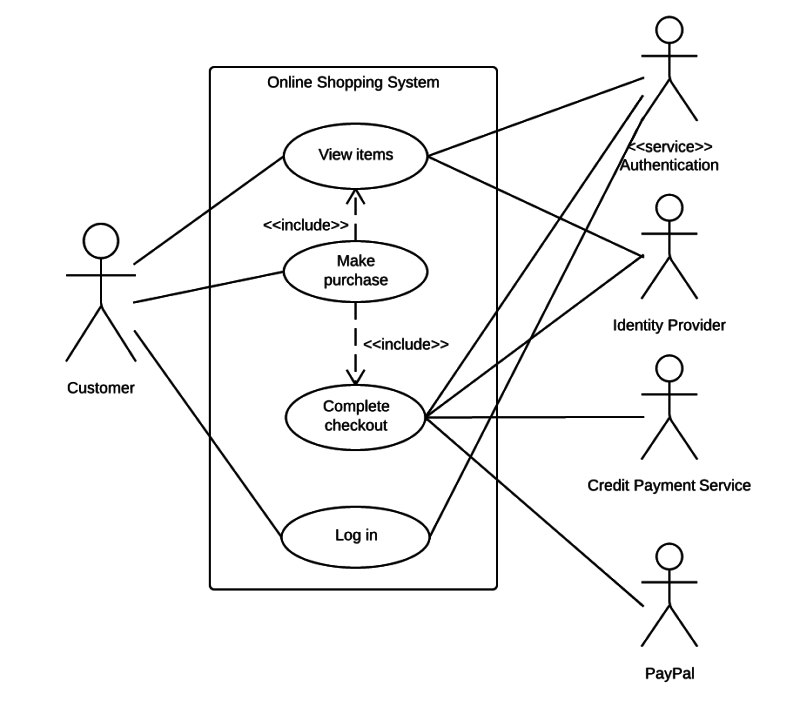

### 032. 유스케이스 다이어그램 (Use Case Diagram)

#### 📘 정의
유스케이스 다이어그램은 **사용자(액터)와 시스템이 상호작용하는 기능(유스케이스)의 관계를 시각화**한 UML 행위 다이어그램이다.  
시스템이 제공해야 할 **기능 단위의 요구사항을 분석하고 표현**하는 데 사용된다.

#### 🧩 핵심 개념 요약
- **사용자(Actor)**와 **유스케이스(Use Case)** 간 상호작용 관계를 표현
- 시스템의 **기능 요구사항 도출과 범위 정의**에 적합
- **Include / Extend / Generalization** 관계로 유스케이스 간 구조화 가능
- **주액터 / 부액터**를 구분하여 **시스템 목표 중심 분석** 가능

#### 🧩 주요 구성 요소

| 구성 요소 | 기호 | 설명 |
|-----------|------|------|
| **액터(Actor)** | 사람 아이콘 / `:Actor` | 시스템 외부에서 상호작용하는 사용자 또는 시스템 |
| **유스케이스(Use Case)** | 타원 `○` | 사용자가 수행할 수 있는 기능 또는 서비스 |
| **시스템 경계(System Boundary)** | 사각형 | 유스케이스가 포함된 시스템의 범위를 나타냄 |
| **관계(Relationship)** | 선 + 키워드 | 연관(—), 포함(<<include>>), 확장(<<extend>>), 일반화(▷) |

#### 🧩 액터 유형

| 구분 | 설명 |
|------|------|
| **주액터 (Primary Actor)** | 시스템의 **주요 목표를 달성하기 위해 상호작용**하는 주체 |
| **부액터 (Secondary Actor)** | 시스템이 동작하는 데 **보조 역할을 수행**하는 외부 주체 |

#### 🖼️ 유스케이스 다이어그램 예시

#### 🧩 유스케이스 관계 설명

| 관계 유형 | 표기 | 의미 |
|-----------|------|------|
| **연관 (Association)** | 실선 `—` | 액터와 유스케이스 간의 기본적인 호출 관계 |
| **포함 (Include)** | `<<include>>` | 공통 유스케이스를 여러 유스케이스에 포함시킬 때 사용 |
| **확장 (Extend)** | `<<extend>>` | 조건에 따라 선택적으로 실행되는 유스케이스 표현 |
| **일반화 (Generalization)** | 속 빈 삼각형 `▷` | 상속 관계, 액터 또는 유스케이스 간 계층 구조 표현 |

#### 📝 기출 포맷 예시
- 유스케이스 다이어그램에서 `<<include>>` 관계의 의미는?
- 다음 중 유스케이스 다이어그램의 구성 요소가 아닌 것은?
- 유스케이스 다이어그램에서 일반화 관계를 사용할 수 있는 대상은?

#### 🧠 용어 설명
- **유스케이스(Use Case)**: 사용자의 관점에서 시스템이 제공해야 하는 기능
- **액터(Actor)**: 시스템 외부에서 유스케이스를 수행하는 주체
- **주액터**: 시스템의 목표 달성을 위한 주요 사용자
- **부액터**: 보조 기능을 수행하거나 시스템에 간접적으로 연결된 주체
- **<<include>> / <<extend>>**: 유스케이스 간 필수/선택적 관계
- **일반화(Generalization)**: 상속 관계를 표현

---

### 033. 유스케이스에서 나타날 수 있는 관계

#### 📘 정의
유스케이스 다이어그램에서는 유스케이스와 유스케이스 간, 액터 간 관계를 통해 **기능 구조를 세분화하고 재사용성, 선택 흐름을 표현**할 수 있다.

#### 🧩 관계 유형 요약

| 관계 유형 | 표기 | 의미 |
|-----------|------|------|
| **연관 (Association)** | 실선 `—` | 액터와 유스케이스 간 상호작용 관계 |
| **포함 (Include)** | `<<include>>` | 여러 유스케이스에서 **공통으로 수행되는 기능**을 분리하여 재사용 |
| **확장 (Extend)** | `<<extend>>` | 유스케이스의 **기본 흐름에서 조건에 따라 추가 동작이 수행**될 때 사용 |
| **일반화 (Generalization)** | 속 빈 삼각형 `▷` | 액터 또는 유스케이스 간 **상속 관계**, 상위 개념의 기능을 하위에서 재사용 |

#### ✅ 관계 간 비교

| 구분 | Include | Extend |
|------|---------|--------|
| 실행 조건 | **무조건 실행** | **조건부 실행** |
| 방향 | 기본 → 포함 | 기본 → 확장 |
| 목적 | 공통 기능 분리 | 선택 기능 추가 |
| 예시 | 로그인 시 감사 로그 기록 | 결제 시 할인 적용 (조건부) |

#### 📝 기출 포맷 예시
- 다음 중 `<<include>>` 관계에 대한 설명으로 옳은 것은?
- 유스케이스 관계 중 조건부 흐름을 나타내는 것은?
- 유스케이스 간 재사용을 위해 사용하는 관계는?

#### 🧠 용어 설명
- **Include**: 반드시 포함되어야 하는 공통 기능
- **Extend**: 조건에 따라 선택적으로 실행되는 추가 기능
- **Generalization**: 공통 기능을 상속해 하위 유스케이스가 재사용
- **Association**: 액터와 유스케이스 간의 기본 연결 관계

---

### 034. 활동 다이어그램 (Activity Diagram)

#### 📘 정의
활동 다이어그램은 시스템이나 객체의 **처리 흐름(로직)** 을 시각적으로 표현하는 UML 행위 다이어그램입니다.  
**업무 절차, 조건 분기, 병렬 처리** 등을 표현하며, **요구사항 분석과 상세 설계 단계**에서 자주 활용됩니다.
#### 🖼️ 활동 다이어그램

#### 🧩 핵심 개념 요약
- 액티비티 중심의 제어 흐름 표현
- 조건 분기, 반복, 병렬 처리 구조에 적합
- 흐름도와 유사하지만 UML의 표준 표현 도구
- 비즈니스 로직, 알고리즘 흐름 등 기술에 활용

#### 🧩 주요 구성 요소

| 구성 요소            | 설명 |
|---------------------|------|
| **액션 / 액티비티**   | 흐름 안에서 실제 수행되는 작업 단위. 둥근 사각형 안에 작업 이름이 들어감. |
| **시작 노드**         | 다이어그램 시작점. 검은 원(●) 하나로 표현. |
| **종료 노드**         | 흐름의 종료점. 이중 원(● 안에 ○)으로 표현. |
| **조건(판단) 노드**    | 조건에 따라 흐름이 분기되는 지점. 마름모(◆)에서 **화살표가 여러 개 나감** (출력 ≥ 2, 입력 1). |
| **병합 노드**         | 분기된 흐름이 다시 하나로 합쳐지는 지점. 마름모(◆)에서 **화살표가 여러 개 들어옴** (입력 ≥ 2, 출력 1). |
| **포크 노드**         | 하나의 흐름을 동시에 여러 개로 나누는 분기점. **가로로 된 굵은 실선**에서 **입력 1 → 출력 N (N ≥ 2)** |
| **조인 노드**         | 여러 흐름을 하나로 합치는 병합점. **가로 굵은 실선**에서 **입력 N (N ≥ 2) → 출력 1** |
| **스윔레인 노드**      | 역할, 부서 등 책임 단위별로 흐름을 구분하는 영역. 세로 또는 가로 칸막이 구획으로 나눔. |

#### 📝 기출 포맷 예시
- 활동 다이어그램에서 **병렬 흐름**을 나타내는 노드는?
- 다음 중 **조건 분기**를 표현하는 구성 요소는?
- **시작 노드와 종료 노드**를 나타내는 기호로 옳은 것은?

#### 🧠 용어 설명
- **액티비티(Activity)**: 작업 단위 또는 상태
- **전이(Transition)**: 흐름 제어를 위한 화살표
- **결정 노드(Decision Node)**: 조건 분기
- **병합 노드(Merge Node)**: 흐름 합류
- **포크/조인(Fork/Join)**: 병렬 처리 분기와 병합
- **시작/종료 노드**: 흐름의 출발점과 종착점
- **스윔레인(Swimlane)**: 역할이나 담당 주체별 구분

---

### 035. 클래스 다이어그램 (Class Diagram)

#### 📘 정의
클래스 다이어그램은 객체지향 시스템에서 **클래스 간의 구조적 관계**를 표현하는 정적 다이어그램이다.  
시스템이 어떤 **데이터 구조와 관계로 구성되어 있는지 시각적으로 표현**하며,  
주로 **설계 단계에서 사용**된다.

#### 🧩 핵심 개념 요약
- 클래스와 클래스 간의 **속성, 메서드, 관계**를 표현
- 객체지향의 **상속, 연관, 집합, 포함 관계**를 도식화
- 시스템의 **정적 구조 설계**를 위한 기본 UML 도구

#### 🧩 주요 구성 요소

| 구성 요소                      | 설명 |
|----------------------------|------|
| **클래스(Class)**             | 속성과 연산(메서드)으로 구성된 틀. 사각형 3단 구성으로 표현됨 (클래스명 / 속성 / 연산) |
| **속성(Attribute)**          | 클래스가 가지는 데이터 값. ex) 이름, 나이 |
| **연산 or 오퍼레이션(Operation)** | 클래스가 수행할 수 있는 기능 또는 메서드 |
| **관계(Relationship)**       | 클래스 간 연결 구조. 다음과 같은 관계가 존재함 |
| **제약조건(Constraint)** | 클래스나 관계에 부가적인 조건이나 규칙을 붙일 때 사용. 중괄호 `{}` 안에 표현함. 예: `{ordered}`, `{readOnly}` |

#### 🧩 클래스 간 관계 종류

| 관계 유형 | 기호 | 설명 |
|-----------|------|------|
| **연관 (Association)** | 실선 | 두 클래스가 서로 알고 있는 관계 |
| **일반화 (Generalization)** | 속 빈 삼각형 화살표 `▷` | 상위 클래스가 하위 클래스에 속성/연산을 물려줌 (상속) |
| **집합 (Aggregation)** | 속 빈 마름모 | 전체-부분 관계. 부분은 독립 생존 가능 |
| **합성 (Composition)** | 속 채운 마름모 | 전체-부분 관계. 부분은 전체가 없으면 존재 불가 |
| **의존 (Dependency)** | 점선 화살표 | 한 클래스가 다른 클래스를 잠깐 참조하는 약한 관계 |

#### 🖼️ 클래스 다이어그램

#### 📝 기출 포맷 예시
- 클래스 간에 강한 전체-부분 관계를 나타내는 관계는?
- 일반화 관계에 사용되는 기호는?
- 집합 관계와 합성 관계의 차이점은?

#### 🧠 용어 설명
- **클래스(Class)**: 객체의 속성과 연산을 정의한 설계도
- **속성(Attribute)**: 객체가 가지는 값(데이터 필드)
- **연산(Operation)**: 객체가 수행할 수 있는 동작
- **연관 / 의존 / 상속 / 집합 / 합성**: 클래스 간 구조적 관계

---

### 036. 연관 클래스 (Association Class)

#### 📘 정의
연관 클래스는 **클래스 간의 연관 관계 자체에 속성이나 연산이 필요한 경우**, 그 관계를 별도로 클래스처럼 표현한 것이다.  
즉, 두 클래스 사이의 연결선(Association)에 **추가 정보를 부여**할 때 사용한다.

#### 🧩 특징
- 일반적인 연관 관계는 단순 연결만 표현하지만, 연관 클래스는 **그 관계를 객체처럼 다룸**
- **연관선 위에 사각형으로 표현되며**, 점선으로 연관 관계와 연결됨
- **속성(attribute)** 과 **연산(operation)** 을 가질 수 있음
- 관계에 부가적인 의미, 이력, 상태 등을 담고 싶을 때 사용

#### 🧩 예시 상황
- 학생과 과목 간 관계에서, **수강 정보(학점, 수강년도 등)** 가 필요한 경우  
  → 학생 — 수강 — 과목 구조  
  → 여기서 ‘수강’이 연관 클래스

#### 🖼️ 연관 클래스 예시

#### 📝 기출 포맷 예시
- 클래스 다이어그램에서 연관 관계에 속성과 연산을 부여하려면 어떤 구조를 사용하는가?
- 연관 클래스는 어느 경우에 필요한가?

#### 🧠 용어 설명
- **연관 클래스 (Association Class)**: 두 클래스 간 연관 자체에 정보를 담기 위한 클래스
- **연관 관계 (Association)**: 클래스 간 연결을 나타내는 기본 구조
- **속성 / 연산**: 연관 클래스도 일반 클래스처럼 가질 수 있음

---

### 037. 순차 다이어그램 (Sequence Diagram)

#### 📘 정의
순차 다이어그램은 시스템이나 객체들이 **메시지를 주고받으며 상호작용하는 순서를 시간의 흐름에 따라 표현**하는 UML 행위 다이어그램이다.  
요구사항 분석 단계에서 사용되며, **객체 간 메시지 흐름과 상호작용의 순서**를 명확히 시각화할 수 있다.

#### 🧩 핵심 개념 요약
- 시간 흐름에 따라 **객체 간 메시지 교환 순서**를 표현
- 사용자 또는 시스템의 **시나리오 흐름 분석에 유용**
- 복잡한 프로세스를 **메시지 흐름 중심으로 단순화**해 표현 가능

#### 🧩 주요 구성 요소

| 구성 요소 | 기호 | 설명 |
|-----------|------|------|
| **액터(Actor)** | `:Actor` | 시스템 외부의 사용자 또는 외부 시스템 |
| **객체(Object)** | `객체명:` | 메시지를 주고받는 내부 주체 |
| **생명선(Lifeline)** | `│` (세로 점선) | 객체가 존재하는 시간 구간을 나타냄 |
| **실행 상자(Activation Box)** | `▭` | 객체가 동작 중인 구간 (메시지 처리 중) |
| **메시지(Message)** | `→` | 객체 간에 전송되는 명령, 요청, 응답 등 |
| **객체 소멸** | `X` | 객체의 생명이 종료되는 시점 |
| **프레임(Frame)** | `sd`, `alt` 등 키워드 박스 | 다이어그램 일부 시나리오를 묶는 구간 |

#### 🖼️ 순차 다이어그램 예시
> ※ 시험에선 주로 프레임 + 메시지 흐름 + 생명선 중심으로 출제됨

#### 📝 기출 포맷 예시
- 순차 다이어그램에서 **생명선은 무엇을 의미하는가?**
- **객체가 동작 중임을 나타내는 요소**는?
- 다음 중 **객체 소멸 시점**을 나타내는 기호는?

#### 🧠 용어 설명
- **Lifeline**: 객체가 메모리에 존재하는 시간 구간
- **Activation Box**: 메시지를 주고받는 동안 객체가 동작 중임을 나타내는 영역
- **Message**: 상호작용을 위해 전달되는 명령/데이터
- **Frame**: 시나리오 흐름의 구조적 구획
- **X 기호**: 객체 소멸 표현

---
### 038. 커뮤니케이션 다이어그램 (Communication Diagram)

#### 📘 정의
커뮤니케이션 다이어그램은 객체 간의 **상호작용 구조**를 중심으로 표현하는 UML 행위 다이어그램이다.  
**객체들이 어떻게 연결(Link)** 되어 있으며, **어떤 순서로 메시지를 주고받는지**를 함께 표현한다.

#### 🧩 핵심 개념 요약
- **객체 간 연결 구조 + 메시지 순서**를 함께 표현
- 메시지에 **번호를 붙여 흐름 순서**를 나타냄
- **순차 다이어그램과 동일한 표현 대상**이지만, 구조 중심 시각화
- **정보 흐름 + 객체 간 네트워크** 파악에 유리

#### 🧩 주요 구성 요소

| 구성 요소 | 기호 | 설명 |
|-----------|------|------|
| **액터(Actor)** | `:Actor` | 시스템 외부 사용자 또는 외부 시스템 |
| **객체(Object)** | `객체명:` | 메시지를 주고받는 내부 주체 |
| **링크(Link)** | `—` (실선) | 객체 간의 연결 관계 |
| **메시지(Message)** | `1:`, `2:` 등 번호 + 화살표 | 메시지 전달 순서 및 내용 |
| **프레임(Frame)** | `sd`, `ref` 등 키워드 박스 | 다이어그램의 전체 또는 일부 묶음 단위 |

#### 🖼️ 커뮤니케이션 다이어그램 예시
> ※ 객체 간 구조 + 메시지 흐름을 함께 표현함

#### 📝 기출 포맷 예시
- 커뮤니케이션 다이어그램에서 **링크의 의미**는?
- 다음 중 **메시지 순서를 함께 나타낼 수 있는 다이어그램**은?
- 커뮤니케이션 다이어그램에서 **프레임은 어떤 역할을 하는가?**

#### 🧠 용어 설명
- **Actor**: 시스템 외부의 사용자 또는 외부 시스템
- **Link**: 객체 간의 연결 관계
- **Message**: 객체 간 전달되는 명령/요청
- **Message Order**: 메시지의 발생 순서 (번호)
- **Frame**: 시나리오 또는 컨텍스트 범위 지정  

---

### 039. 상태 다이어그램 (State Diagram)

#### 📘 정의
상태 다이어그램은 시스템이나 객체가 **이벤트 발생에 따라 상태가 어떻게 전이되는지를 시각적으로 표현**하는 UML 행위 다이어그램이다.  
객체의 **생명 주기(Life Cycle)**, 동작 흐름, 상태 변화 조건 등을 명확히 나타낸다.

#### 🧩 핵심 개념 요약
- **객체 또는 시스템의 상태 변화** 흐름을 표현
- **이벤트 발생 → 상태 전이** 구조
- 복잡한 상태 기반 로직을 시각화
- **조건 분기, 반복 처리 흐름** 등에도 사용 가능

#### 🧩 주요 구성 요소

| 구성 요소              | 기호        | 설명                   |
|--------------------|-----------|----------------------|
| **상태(State)**      | 둥근 사각형    | 객체가 일정 시간 머무는 조건/상태  |
| **시작 상태(Start)**   | ●         | 상태 다이어그램의 시작점        |
| **종료 상태(End)**     | ●◯ (이중 원) | 상태 다이어그램의 종료점        |
| **전이(Transition)** | →         | 상태 간 이동을 나타내는 화살표    |
| **이벤트(Event)**     | `이벤트명()`  | 상태 전이를 유발하는 입력 또는 조건 |
| **프레임(Frame)**     | 박스 표시     | 다이어그램의 범위            |

#### 🖼️ 상태 다이어그램 예시
> ※ 이벤트를 통해 상태가 전이되는 흐름을 표현함

#### 📝 기출 포맷 예시
- 상태 다이어그램에서 **전이(Transition)**는 무엇을 의미하는가?
- 다음 중 **상태 다이어그램의 종료 상태를 나타내는 기호**는?
- 상태 전이를 **발생시키는 요소는 무엇인가?**

#### 🧠 용어 설명
- **State**: 객체가 유지되는 조건이나 상황
- **Transition**: 상태 간의 이동
- **Event**: 전이를 유발하는 트리거
- **Start/End**: 상태 흐름의 시작과 종료 위치  

---

### 040. 패키지 다이어그램 (Package Diagram)

#### 📘 정의
패키지 다이어그램은 시스템을 **논리적 단위인 패키지(Package)** 로 나누고,  
**패키지 간의 의존 관계**를 표현하는 UML 구조 다이어그램이다.  
복잡한 시스템 구조를 **모듈화하고 계층화**하는 데 활용된다.

#### 🧩 핵심 개념 요약
- 클래스, 유스케이스 등을 **패키지 단위로 그룹화**
- **패키지 간 의존 관계**를 표현 (`<<import>>`, `<<access>>`, `<<merge>>`)
- **객체 간 의존 관계를 기반으로 패키지 간 의존 유도**
- 시스템의 **구조 설계, 네임스페이스 관리, 모듈 재사용성 향상**에 유용

#### 🧩 주요 구성 요소

| 구성 요소 | 기호 | 설명 |
|-----------|------|------|
| **패키지(Package)** | 폴더 모양 상자 | 관련 UML 요소를 묶는 논리 단위 |
| **의존 관계(Dependency)** | 점선 화살표 `--->` | 다른 패키지에 접근하거나 참조하는 관계 |
| **<<import>>** | 점선 화살표 + `<<import>>` | 다른 패키지의 **객체를 직접 가져와 내부에서 사용** |
| **<<import>>** | 점선 화살표 + `<<import>>` | 다른 패키지의 **public 요소**를 직접 가져와 내부에서 사용함 (**객체를 직접 포함**) |
| **<<access>>** | 점선 화살표 + `<<access>>` | 다른 패키지의 **private 요소**에 인터페이스를 통해 접근함 (**간접 참조**) |
| **내포(Nesting)** | 패키지 내부에 또 다른 패키지 포함 | 계층적 구조 표현

#### 🧩 출제 개념: 객체 간 의존 → 패키지 간 의존
- 객체 A → 객체 B 간 의존이 있을 경우  
  → 객체 A가 속한 **패키지는 객체 B의 패키지에 의존**
- 즉, **패키지 간 의존 관계는 포함된 객체 간의 의존 관계에서 유도됨**
- 정보처리기사 실기에서 자주 출제되는 핵심 포인트

#### 🖼️ 패키지 다이어그램 예시
> ※ 의존 관계, 계층 구조 중심으로 표현됨

#### 📝 기출 포맷 예시
- 다음 중 **`<<import>>` 관계의 설명으로 가장 적절한 것은?**
- 패키지 다이어그램에서 **`<<access>>` 관계는 어떤 방식으로 객체에 접근하는가?**
- **패키지 간 의존 관계는 무엇을 기준으로 형성되는가?**

#### 🧠 용어 설명
- **Package**: UML 요소를 논리적으로 묶은 모듈 단위
- **Dependency**: 다른 패키지를 참조하거나 사용하는 관계
- **Import**: 외부 패키지의 객체를 직접 가져와 사용
- **Access**: 외부 패키지의 객체에 인터페이스를 통해 접근
- **Merge**: 두 패키지를 병합하여 확장
- **Nesting**: 패키지 안에 또 다른 패키지를 포함
- **객체 간 의존 → 패키지 간 의존**: 시험 출제 핵심 구조  

---

### 041. 구조적 방법론 (Structured Methodology)

#### 📘 정의
구조적 방법론은 시스템을 **처리(Process) 중심으로 분석·설계**하는 전통적인 절차적 개발 방법론이다.  
시스템이 수행해야 할 **기능을 중심으로 처리 흐름을 정의**하며,  
**데이터 흐름도(DFD)**를 통해 전체 시스템의 구조와 흐름을 표현한다.

> ※ 일부 서술에서는 "기능 중심"이란 표현도 사용되지만,  
> 정보처리기사 시험에서는 반드시 "**처리 중심 방법론**"으로 표현해야 정답 처리됨.

#### 🧩 개발 절차
> ※ 교재 기준 순서 정리

1. **요구사항 정의**
2. **기능 분해 및 자료 흐름 도식화**
3. **자료 흐름도(DFD) 작성**
4. **자료 사전 작성**
5. **프로세스 명세서 작성**

#### 🧩 시험 출제 포인트 요약
- **처리 중심** 설계 방식 (기능 흐름 분석 포함)
- **DFD, 자료사전** 도구의 목적과 용도 구분
- **개발 절차 순서** 관련 문제 출제 다수

#### 🧠 용어 설명
- **DFD (Data Flow Diagram)**: 처리 기능 간 데이터 흐름을 도식화한 도구
- **자료 사전(Data Dictionary)**: DFD에 사용된 데이터 항목을 정의한 명세서
- **프로세스 명세서 (Process Spec)**: 각 기능(프로세스)의 처리 내용을 기술
- **기능 분해 (Functional Decomposition)**: 상위 기능을 점진적으로 세분화하는 설계 기법
- **처리 중심(=기능 흐름 중심)**: 시스템이 수행할 처리 과정을 분석하고 흐름에 따라 구조화하는 방식  

---

### 041. 구조적 방법론 (Structured Methodology)

#### 📘 정의
구조적 방법론은 시스템을 **처리(Process) 중심으로 분석·설계**하는 전통적인 절차적 개발 방법론이다.  
시스템이 수행해야 할 **기능을 중심으로 처리 흐름을 정의**하며,  
**데이터 흐름도(DFD)**를 통해 전체 시스템의 구조와 흐름을 표현한다.

> ※ 일부 서술에서는 "기능 중심"이란 표현도 사용되지만,  
> 정보처리기사 시험에서는 반드시 "**처리 중심 방법론**"으로 표현해야 정답 처리됨.

#### 🧩 개발 단계

1. **타당성 검토**
2. **계획**
3. **요구사항 분석**
4. **설계**
5. **구현**
6. **시험(Test)**
7. **운용 및 유지보수**

#### 🧩 시험 출제 포인트 요약
- **처리 중심** 설계 방식 (기능 흐름 분석 포함)
- **DFD, 자료사전** 도구의 목적과 용도 구분
- **개발 절차 순서** 관련 문제 출제 다수

#### 🧠 용어 설명
- **DFD (Data Flow Diagram)**: 처리 기능 간 데이터 흐름을 도식화한 도구
- **자료 사전(Data Dictionary)**: DFD에 사용된 데이터 항목을 정의한 명세서
- **프로세스 명세서 (Process Spec)**: 각 기능(프로세스)의 처리 내용을 기술
- **기능 분해 (Functional Decomposition)**: 상위 기능을 점진적으로 세분화하는 설계 기법
- **처리 중심(=기능 흐름 중심)**: 시스템이 수행할 처리 과정을 분석하고 흐름에 따라 구조화하는 방식  
